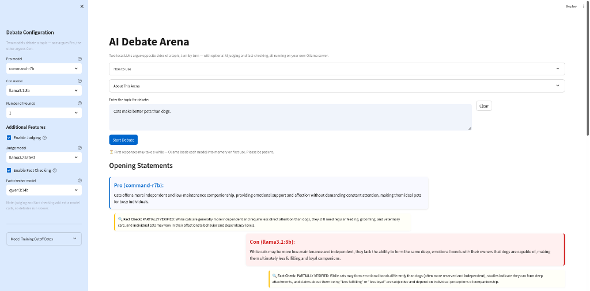

# LLM Debater 🚨

An interactive AI debate platform that enables structured debates between different language models. Watch as AI models argue opposite sides of a topic, turn by turn — with optional judging and fact-checking capabilities.



## Why I Built This

Benchmarks tell you how a model scores on a test, but not how it reasons under pressure or defends a position. I built this to pit local models against each other in structured debates — a more revealing way to compare their persuasiveness, consistency, and ability to respond to counter-arguments. Since everything runs through Ollama, debates are fully local and private, and trying a new model is a config change rather than a code change.

## Features

- **Multiple AI Debaters**: Choose from various LLM models (Llama, Qwen, Gemma, Phi-4, Mistral, Command R — configurable via `.env`) for both Pro and Con positions
- **Structured Debate Format**: Multi-round debates with opening statements and rebuttals
- **Live Streaming**: Arguments stream into the UI token by token as models generate them
- **Per-round Scoring**: Optional judging system that evaluates each round with a reason and determines a winner
- **Fact Checking**: Optional fact-checking of statements during the debate
- **Export Transcripts**: Download any debate as a Markdown file
- **Customizable Settings**: Configure number of rounds, models, argument length, and additional features
- **Interactive UI**: Clean, user-friendly interface built with Streamlit
- **Docker Support**: Easy deployment using Docker

## How It Works

1. **Configuration** — In the sidebar you pick a Pro model, a Con model, and the number of rounds. Judging and fact-checking are optional extras, each run by a model of your choice.
2. **Round 1 — Opening statements** — Pro is prompted to argue the topic statement is TRUE; Con is prompted to argue it is FALSE. Argument length is configurable (one sentence or a short paragraph).
3. **Rounds 2+ — Rebuttals** — Each debater receives the full running transcript plus its opponent's last argument, and is asked for a new counter-argument that doesn't repeat its earlier points.
4. **Judging (optional)** — After each round, the judge sees the topic and that round's two arguments, then answers `WINNER — one-sentence reason`. Wins score a point, ties score half. After the final round the judge writes a short verdict explaining the outcome.
5. **Fact checking (optional)** — After every statement, the fact-checker model labels it `VERIFIED`, `PARTIALLY VERIFIED`, or `UNVERIFIED` with a one-sentence rationale.
6. **Mechanics** — Debater arguments stream token-by-token from Ollama's `/api/generate` endpoint; judge and fact-check calls are non-streaming. The rendered debate is kept in Streamlit session state, so it stays on screen across reruns until you start a new debate or hit Clear.

## Why It's an Interesting Sandbox

- **Model comparison under identical conditions** — same prompts, same topic, same rules. Watching two models argue is a much more revealing comparison than reading benchmark scores.
- **Prompt-engineering playground** — the prompts in `debate_manager.py` are short and easy to edit; small wording changes visibly change argument quality, which makes this a cheap way to learn prompt sensitivity.
- **Failure modes on display** — you'll see real LLM quirks in the wild: repetition across rounds, hallucinated "studies," judges that reward verbosity, and models that cave when challenged.
- **Fully local and private** — everything runs on your own Ollama server; no API keys, no data leaves your network.

## Limitations

- **Short arguments by design** — even at the "short paragraph" setting, arguments cap at 3–4 sentences for readability, which limits how deep the reasoning can go.
- **"Fact checking" isn't real fact checking** — the checker can only consult its own training data. It will confidently mislabel things, especially anything after its knowledge cutoff (shown in the sidebar).
- **Judging is not reliable** — LLM judges have positional bias, often reward confident-sounding answers, and may score identical quality differently run to run. Treat scores as entertainment, not measurement.
- **No persistence** — debates live only in the browser session; nothing is saved unless you download the transcript.

## A Word of Caution

**This is a demo/sandbox project — do not use it for anything real.**

The arguments, scores, verdicts, and fact-check labels are LLM output and can be confidently wrong. Do not use them to inform decisions, settle actual disagreements, or evaluate models for production use. The app itself is unauthenticated and unhardened — keep it on your local network and don't expose it publicly.

## Prerequisites

- Python 3.9+
- Docker
- Ollama server running with supported models

## Installation

### Using Docker

1. Clone the repository:
```bash
git clone https://github.com/drintoul/llm-debater.git
cd llm-debater
```

2. Copy `.env.example` to `.env` and configure your settings (Ollama host, models, rounds):
```bash
cp .env.example .env
```

3. Build and run using Docker Compose:
```bash
docker-compose up --build
```

### Manual Installation

1. Clone the repository:
```bash
git clone <repository-url>
cd llm-debater
```

2. Install dependencies:
```bash
pip install -r requirements.txt
```

3. Copy `.env.example` to `.env` and set `OLLAMA_HOST` (and optionally the available models):
```bash
cp .env.example .env
```

4. Run the application:
```bash
streamlit run app.py
```

## Usage

1. Access the application at `http://localhost:8505` (Docker) or `http://localhost:8501` (manual installation)

2. Configure your debate:
   - Select the Pro and Con debater models
   - Set the number of debate rounds (1-5)
   - Pick an argument length (one sentence or short paragraph)
   - Enable/disable judging and fact-checking features
   - Choose models for judging and fact-checking if enabled

3. Enter a debate topic in the main text area

4. Click "Start Debate" to begin — arguments stream in live as each model generates them

5. Click "Download Transcript" afterwards to save the debate as Markdown

## Model Information

The default model lineup (configurable via `AVAILABLE_MODELS` and `MODEL_CUTOFF_DATES` in `.env`):

| Model | Training cutoff |
|-------|-----------------|
| llama3.1:8b | December 2023 |
| llama3.2:latest | December 2023 |
| qwen3:14b | March 2025 |
| phi4:latest | June 2024 |
| gemma2:9b | June 2024 |
| mistral-nemo:latest | Unknown |
| command-r7b | Unknown |
| hermes3:8b | December 2023 |

Models must be pulled on your Ollama server first: `ollama pull <model>`.

## Project Structure

- `app.py`: Main Streamlit application
- `config.py`: Configuration settings and constants
- `debate_manager.py`: Core debate logic and LLM interactions
- `llm_service.py`: LLM API communication service
- `ui_components.py`: UI components and styling
- `styles.py`: CSS styles for the interface
- `docker-compose.yaml`: Docker Compose configuration
- `Dockerfile`: Docker container configuration
- `requirements.txt`: Python dependencies
- `requirements-dev.txt`: Dev dependencies (pytest)
- `tests/`: Unit tests for parsing and scoring helpers
- `.env.example`: Environment variable template (copy to `.env`)
- `.streamlit/config.toml`: Streamlit theme settings

## Environment Variables

Configuration is loaded from a `.env` file (see `.env.example` for a template):

- `OLLAMA_HOST`: URL of the Ollama server (default: `http://localhost:11434`)
- `AVAILABLE_MODELS`: Comma-separated list of models offered in the UI
- `MODEL_CUTOFF_DATES`: JSON map of model name to training cutoff date (manually maintained — not sourced automatically; some model creators don't publish cutoffs, use `"unknown"`)
- `MAX_ROUNDS`: Maximum number of debate rounds (default: `5`)
- `DEFAULT_ROUNDS`: Default number of debate rounds (default: `3`)
- `APP_PORT`: Port the app is served on when using Docker (default: `8505`)

## Testing

Unit tests cover the fact-check label normalization, score formatting, and judge-response parsing — no Ollama server required:

```bash
pip install -r requirements-dev.txt
python -m pytest tests/
```

## License

MIT License (c) 2025 Dave Rintoul

## Acknowledgments

- Built with [Streamlit](https://streamlit.io/)
- Powered by [Ollama](https://ollama.ai/)
- Uses various open-source LLM models
